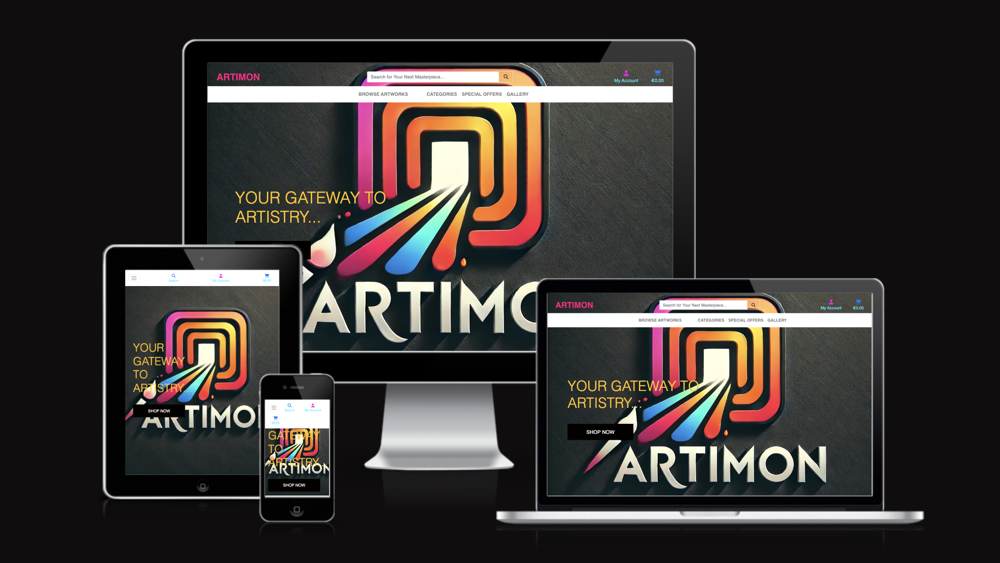
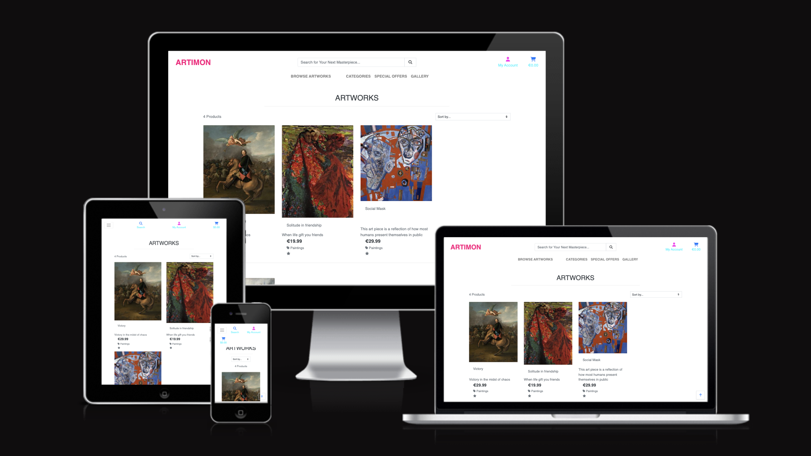
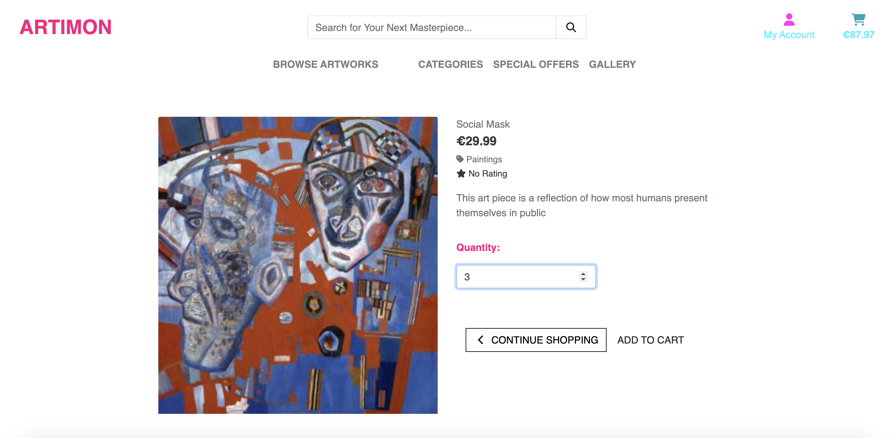
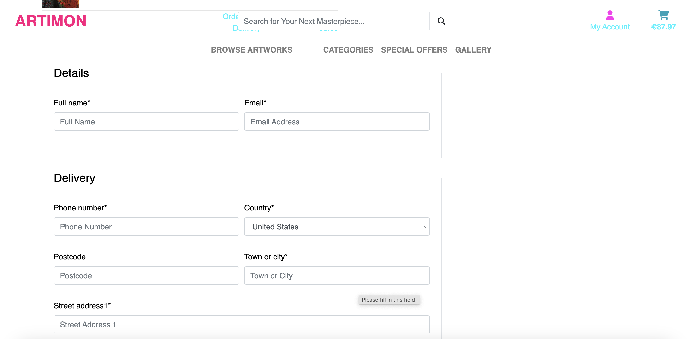

# Artimon: E-Commerce Platform for Art Lovers

**Artimon** is an online platform designed for art enthusiasts to browse, purchase, and engage with a variety of artworks, including paintings, sculptures, and more. The platform provides a seamless experience for users to explore unique artistic creations, securely shop online, and manage their accounts. Additionally, Artimon offers a space for learning about various artists and their stories.

## Table of Contents

- [Project Overview](#project-overview)
- [Features](#features)
  - [User Features](#user-features)
  - [Admin Features](#admin-features)
  - [Security Features](#security-features)
- [Technologies Used](#technologies-used)
- [Installation](#installation)
  - [Clone Repository](#clone-repository)
  - [Dependencies](#dependencies)
  - [Environment Variables](#environment-variables)
  - [Database Setup](#database-setup)
  - [Running the Application](#running-the-application)
- [Stripe Payment Integration](#stripe-payment-integration)
- [Models](#models)
- [Testing](#testing)
- [Deployment](#deployment)
- [Contributing](#contributing)
- [License](#license)

## Project Overview

Artimon was developed to provide art lovers with a platform where they can easily browse and purchase art in a secure, user-friendly environment. It allows users to create accounts, log in, and securely pay for items in their shopping cart using integrated payment solutions. Users can also view their purchase history and read about various artists and their work. Note, this project is still under improvement due to time and other meassures beyond my control. after assessment I am going to greatly enhance the platform and its features. 

## Features

### User Features

1. **Homepage**: Artimon welcomes users with a beautiful landing page that showcases featured artworks and the latest art pieces.

2. **Product Listings**: Users can browse and search through various art categories like paintings and sculptures, view detailed product information, and add items to their cart. 

3. **User Authentication**: Users can create accounts, log in, and manage their profiles, including their saved addresses and personal information.
4. **Shopping Cart**: The cart feature allows users to add and remove items, view their cart contents, and adjust the quantity of products.
5. **Checkout and Payment**: Secure payment processing is integrated with Stripe, allowing users to make payments using credit cards. 
6. **Order History**: Logged-in users can view their previous orders and access detailed information about past purchases.
7. **Artist Information**: Users can learn more about the artists behind each piece of work, with dedicated sections to showcase their biographies and stories.

### Admin Features

1. **Product Management**: Admins can add, edit, and remove products, as well as manage product categories.
2. **Order Management**: Admins have access to view and manage user orders, including marking them as fulfilled.
3. **User Management**: The platform allows admin control over user accounts, including viewing user information and handling support queries.

### Security Features

1. **Authentication & Authorization**: Artimon uses Django Allauth for secure user authentication and registration, including email verification.
2. **CSRF Protection**: Cross-Site Request Forgery protection is enabled to prevent unauthorized actions.
3. **Stripe Payment Integration**: Payments are securely processed through Stripe’s payment gateway, ensuring safe transactions with industry-standard encryption.

## Technologies Used

- **Front-End**:
  - HTML
  - CSS (custom styling and Bootstrap 4 for responsive design)
  - JavaScript (Stripe integration)
  - Font Awesome (for icons)
- **Back-End**:
  - Django 5.1
  - Python 3.12
  - SQLite (for development) / PostgreSQL (for production)
- **Third-Party Integrations**:
  - **Stripe**: Secure payment gateway for processing transactions.
  - **Crispy Forms**: For better form styling using Bootstrap 4.
  - **Cloudinary**: For managing media files and static assets.
  - **Allauth**: For managing user authentication, login, and registration.
- **Version Control**:
  - Git for version control and GitHub for repository hosting.
- **Deployment**:
  - Heroku for hosting the application.
  - Cloudinary for managing static and media files in production.

## Installation

### Clone Repository

1. Clone the repository from GitHub:
   ```bash
   git clone https://github.com/yourusername/artimon.git
   cd artimon
   ```

### Dependencies

2. Install the project dependencies:
   ```bash
   pip install -r requirements.txt
   ```

### Environment Variables

3. Set up environment variables by creating a `.env` file in the root of the project. Add the following variables:

   ```bash
   SECRET_KEY=<your_django_secret_key>
   DEBUG=True
   STRIPE_PUBLIC_KEY=<your_stripe_public_key>
   STRIPE_SECRET_KEY=<your_stripe_secret_key>
   DATABASE_URL=<your_database_url>
   ```

### Database Setup

4. Migrate the database to set up the necessary tables:
   ```bash
   python manage.py migrate
   ```

5. Create a superuser for accessing the admin panel:
   ```bash
   python manage.py createsuperuser
   ```

### Running the Application

6. Run the development server:
   ```bash
   python manage.py runserver
   ```

Access the application at `http://127.0.0.1:8000/`.

## Stripe Payment Integration

Artimon is integrated with **Stripe** to handle secure payments. During checkout, users can enter their card details, and Stripe securely processes the transaction. Ensure that the **Stripe public and secret keys** are set in your environment variables.

For testing purposes, use Stripe’s test card numbers, such as:

```
4242 4242 4242 4242 (Visa)
CVC: Any 3 digits
Expiry: Any future date
```

## Models

Artimon's core models include:

1. **Product**: Contains all the information related to individual products (artworks), including name, description, price, image, and category.
2. **Order**: Stores details of customer orders, including customer information, order total, and delivery address.
3. **OrderLineItem**: Holds details about individual items in an order.
4. **User Profile**: Allows users to save their delivery and personal information for future orders.

## Testing

You can run tests for the application using Django’s built-in test framework:
```bash
python manage.py test
```

## Deployment

Artimon is deployed on **Heroku** with a PostgreSQL database for production. Static and media files are served via **Cloudinary**. To deploy:

1. Set up your Heroku app and connect it to your GitHub repository.
2. Set the necessary environment variables (as described above) in the Heroku dashboard.
3. Push the code to Heroku:
   ```bash
   git push heroku main
   ```


## Acknowledgement 

1. Django: The powerful web framework that served as the foundation of this project.
2. Stripe: For providing the secure payment gateway integration.
3. Bootstrap: The responsive front-end framework that helped with the layout and design of the platform.
4. Crispy Forms: For making form rendering easier and more elegant within Django templates.
5. Cloudinary: For handling image and static file management seamlessly in the cloud.
6. FontAwesome: For providing high-quality icons used across the website.
7. Code Institute: For their support and the resources provided during the development of Artimon.
8. Heroku: For providing hosting and deployment support for Artimon.
9. ChatGPT: This README and various technical solutions throughout the project were enhanced using ChatGPT, a large language model trained by OpenAI, for brainstorming, code suggestions, and guidance.


## Contributing

If you’d like to contribute to Artimon, please fork the repository and create a pull request with your changes. All contributions are welcome!

## License

This project is licensed under the MIT License.

---

Artimon is a platform where the love for art and technology come together to provide users with a seamless and secure shopping experience. Thank you for visiting more improvements in the future!